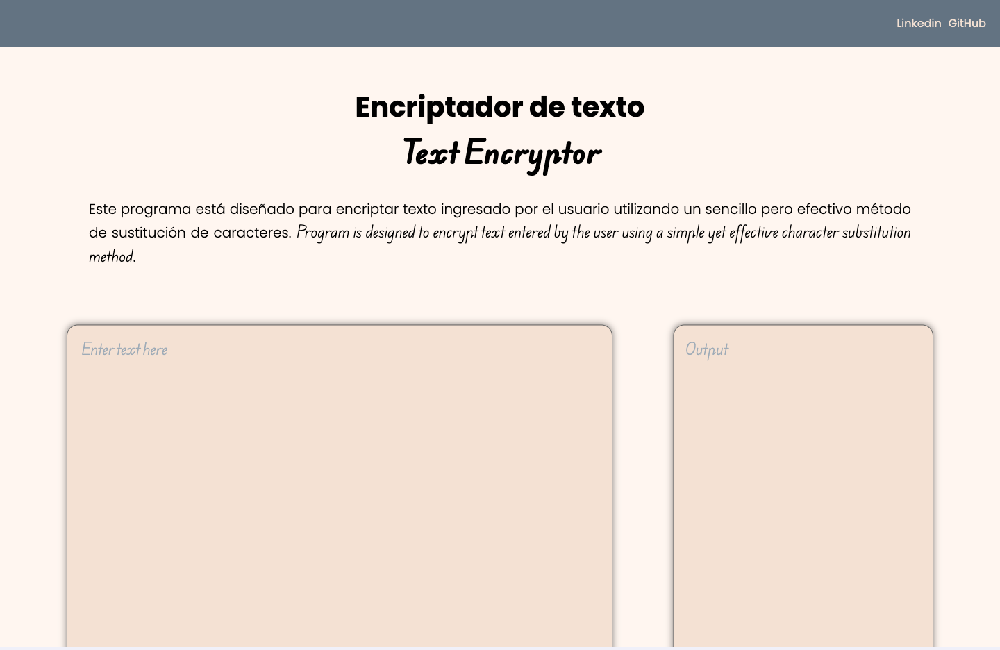
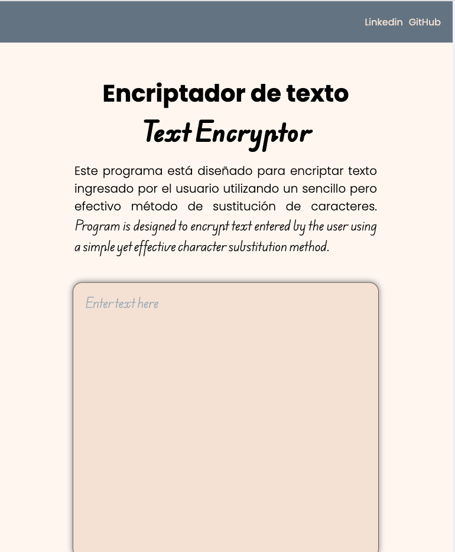
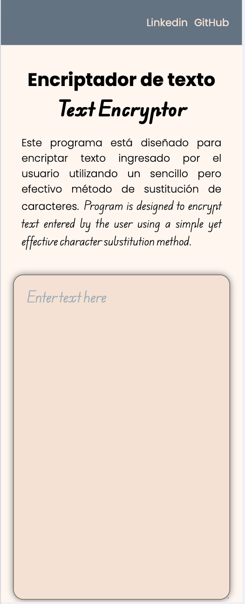

<h1>Text Encryptor</h1>

Text Encryptor es una aplicación web sencilla pero efectiva diseñada para encriptar y desencriptar texto ingresado por el usuario. Utiliza un método de sustitución de caracteres para transformar el texto, proporcionando una capa básica de seguridad para la información sensible. Esta herramienta es ideal para usuarios que desean experimentar con conceptos básicos de criptografía en una interfaz amigable.

<h2>Características</h2>
<ul>
  <li><strong>Encriptación y Desencriptación:</strong> Transformación bidireccional de texto utilizando un método de sustitución de caracteres.</li>
  <li><strong>Interfaz de Usuario Intuitiva:</strong> Dos áreas de texto separadas para la entrada y salida del texto encriptado/desencriptado.</li>
  <li><strong>Botones Funcionales:</strong>Botones dedicados para encriptar, desencriptar y copiar el texto procesado.</li>
</ul>

<h2>Tecnologías Utilizadas</h2>
<ul>  
  <li><strong>HTML5 y CSS3:</strong> Estructura y estilos del sitio web.</li>
  <li><strong>JavaScript:</strong> Lógica de encriptación y desencriptación, y manipulación del DOM</li>
  <li><strong>Google Fonts:</strong> Fuentes personalizadas para una mejor experiencia visual.</li>
  <li><strong>GitHub: </strong>Plataforma de alojamiento para el código fuente.</li>
</ul>

<h2>Configuración Responsive</h2>

Ajuste de la interfaz gráfica para garantizar una visualización óptima en escritorios, tabletas y smartphones.

<ol>
  <li>1440 x 1024 píxeles
  
    <ul>
       <li>Optimizado para pantallas de escritorio y monitores de alta resolución.</li>
    </ul>
  </li>
   
  <li>768 x 1174 píxeles</li>
  
    <ul>
      <li>Ideal para tabletas y dispositivos con pantallas intermedias.</li>
    </ul>
   
  <li>375 x 933 píxeles</li>
  
    <ul>
      <li>Diseñado para smartphones con pantallas más largas y estrechas.</li>
    </ul>
</ol>

<h2 style="text-align: center">Autor</h2>

Giovanny Giovanny Oyola Rivas 
Ibague, Tolima, Colombia 
Alura - Oracle

------------

